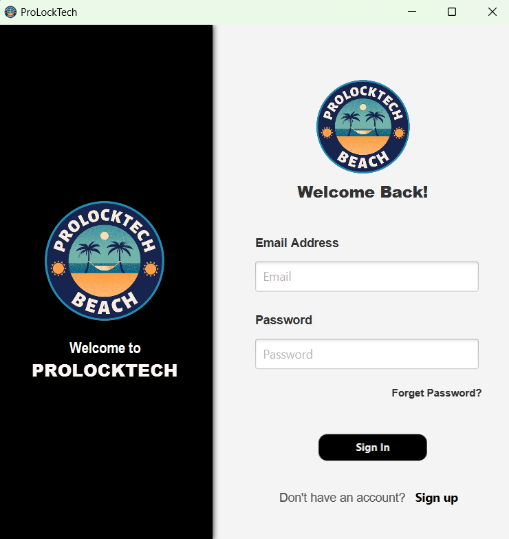
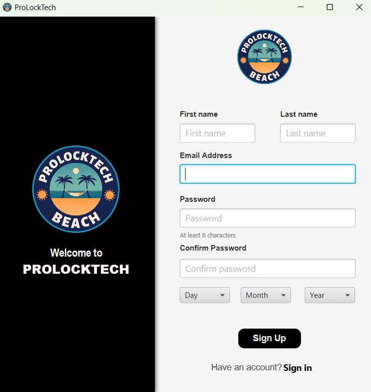
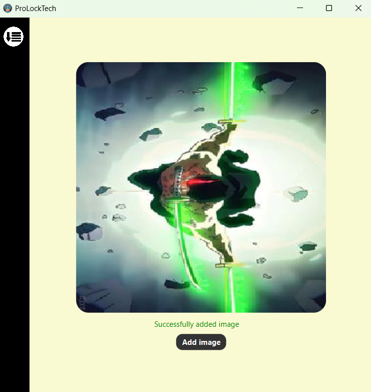
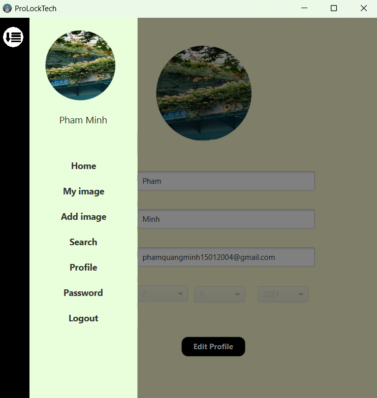
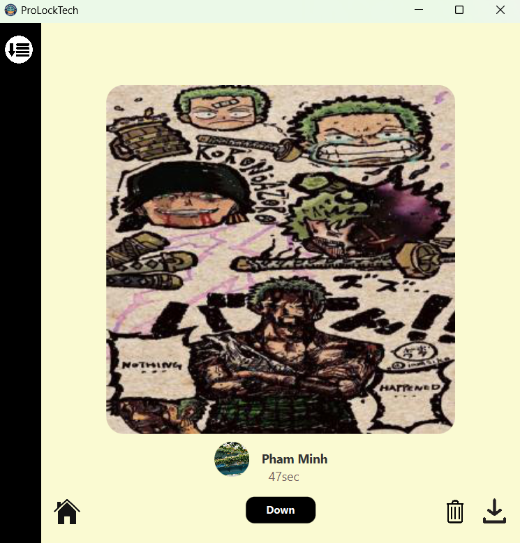
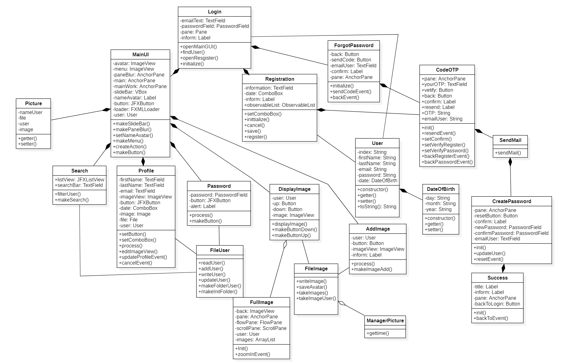
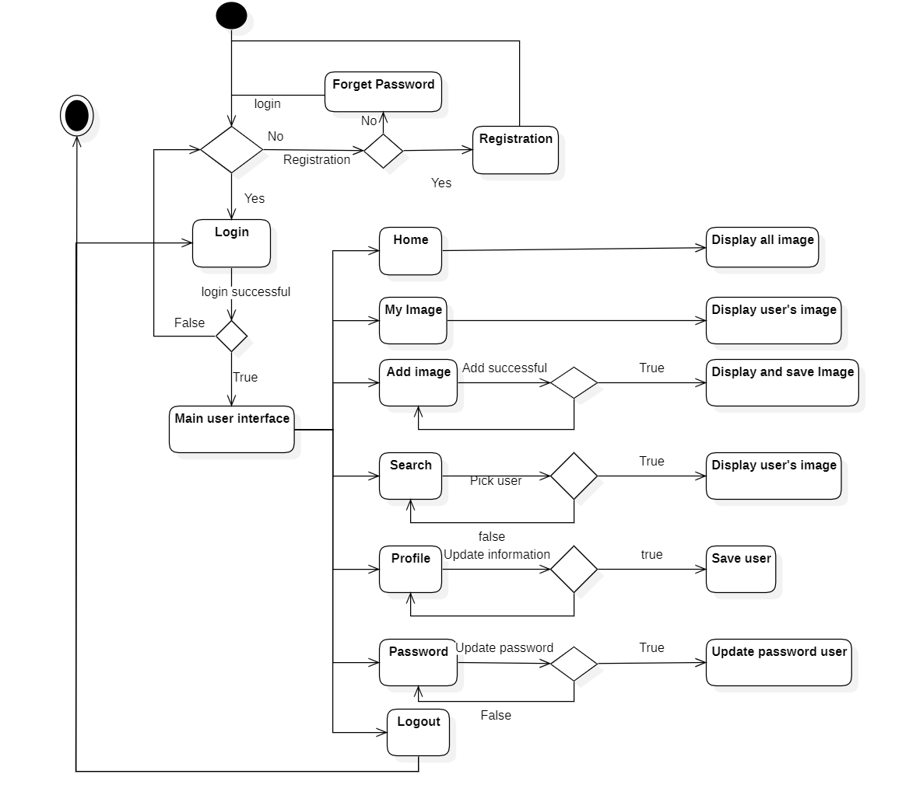

# ProLockTech
**ProLockTech** is an application that makes it possible for users to add photos, download photos and view photos of others on the application.
The project was done by **Phạm Quang Minh**, in the course of Object Oriented Programming at **ProPTIT**.

# Tech Stask
- **Java**
# Installation
- Clone the repo
- Open the project in your IDE
- Run the project
- Run ProLockTech.jar
# Demo

Demo Video: https://www.youtube.com/watch?v=7d10WfI8tAk
# Images

- **Login**


- **Registration**


- **Add Image**


- **Update profile**


- **Main interface**


# Usage
- Project Structure
```bash

├── java
│   ├── main
│   │   ├── prolocktech
│   │   │   ├── Controller
│   │   │   |   ├── FileImage.java
│   │   │   |   ├── FileUser.java
│   │   │   |   ├── ManagerPicture.java
│   │   │   |   ├── SendMail.java
│   │   │   ├── Model
|   |   |   |   ├── DateOfBirth.java
│   │   │   |   ├── Picture.java
│   │   │   |   ├── User.java
│   │   │   ├── Model
|   |   |   |   ├── forgotpassword
│   │   │   |   |   ├── CodeOTP.java
│   │   │   |   |   ├── CreatePassword.java
│   │   │   |   |   ├── ForgotPassword.java
│   │   │   |   |   ├── Success.java
│   │   │   |   ├── login
│   │   │   |   |   ├── Login.java
│   │   │   |   ├── mainui
│   │   │   |   |   ├── AddImage.java
│   │   │   |   |   ├── DisplayImage.java
│   │   │   |   |   ├── FullImage.java
│   │   │   |   |   ├── MainUI.java
│   │   │   |   |   ├── Password.java
│   │   │   |   |   ├── Profile.java
│   │   │   |   |   ├── Search.java
│   │   │   |   ├── register
│   │   │   |   |   ├── Registration.java
│   │   │   ├── InitApp.java
│   │   │   ├── Main.java
```
## Class Diagram

## Activity Diagram


# Contributing
Pull requests are welcome. For major changes, please open an issue first to discuss what you would like to change.

Please make sure to update tests as appropriate.
# License
